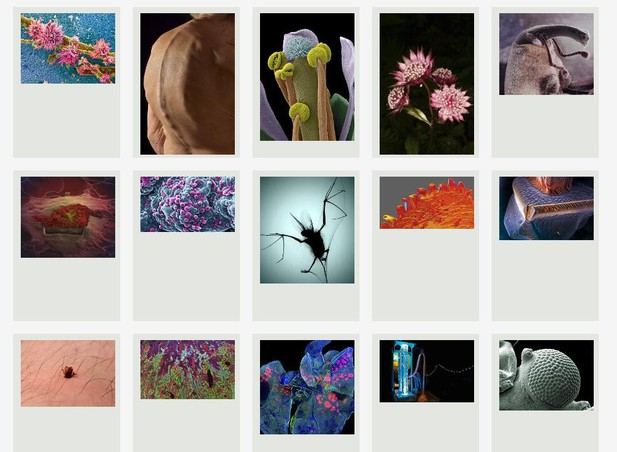

# International Image Interoperability Framework (IIIF) para editoriales científicas
Traducción del artículo del sitio https://elifesciences.org/labs/aabe94cd/publishing-scientific-images-using-the-iiif

Nos complace presentar International Image Interoperability Framework (IIIF), un marco de imagen impulsado por la comunidad con APIs definidas para hacer que los repositorios de imágenes del mundo sean inter-operables y accesibles.

Para comunicar descubrimientos importantes, a veces las imágenes pueden ser tan efectivas como el texto simple, si no más. Este blogpost proporciona una visión general del estándar IIIF, con énfasis en su potencial para editoriales Científicas, Técnicas, y Médicas (CTM), e invita a esas organizaciones a participar en un servicio piloto ofrecido por la Biblioteca Wellcome.

Apoyado en el marco IIIF, el nuevo [Digital Library Cloud Service(DLCS)](https://dlcs.gitbooks.io/book/content/overview.html) del Fideicomiso Wellcome es una infraestructura basada en la nube que pretende ofrecer servicios rápidos, escalables, y de amplia disponibilidad para la presentación de imágenes en formas enriquecidas y atractivas.

Muchas grandes bibliotecas de investigación han adoptado IIIF para presentar sus imágenes digitales, pero muchas editoriales CTM aún deben experimentar sus beneficios.

Blogpost de Robert Kiley, Jefe de Servicios Digitales, Biblioteca Wellcome [kiley@wellcome.ac.uk](mailto:r.kiley@wellcome.ac.uk), y Tom Crane, Director Técnico, Digirati [tom.crane@digirati.com](mailto:tom.crane@digirati.com).

## El potencial de IIIF para las editoriales CTM

Es ampliamente reconocido que una imagen vale mil palabras, y eso es especialmente cierto en la web. No obstante, combinar en un único objeto digital colecciones de imágenes mantenidas en sitios web distintos, y presentar las mismas mediante una aplicación rica en funcionalidad, es una tarea difícil.

Ese fue el problema que quiso solucionar un grupo de bibliotecarios con interés especial en los manuscritos medievales. La meta era proporcionar a sus usuarios una sola herramienta para acceder a las imágenes digitalizadas, y que la experiencia de visualización incluyera funcionalidades como zoom profundo, búsqueda, y anotación. Todo eso llevó al desarrollo de IIIF.

En los últimos dos años, muchas grandes bibliotecas de investigación del mundo han comenzado a presentar sus imágenes digitalizadas usando ese marco. Sin embargo, pocas editoriales CTM han adoptado el estándar, aun cuando las imágenes, en forma de figuras, juegan un papel fundamental en la diseminación de la información académica.

**Figura 1.** Una colección IIIF de imágenes biomédicas de la Biblioteca Wellcome [https://alpha.wellcomelibrary.org/collections/biomed](https://alpha.wellcomelibrary.org/collections/biomed)

Son varios los beneficios de IIIF para las editoriales CTM:

- Permite presentar imágenes en plataformas propias en forma enriquecida y atractiva. Muchas editoriales ofrecen imágenes en tamaño completo en sus artículos online, pero muy pocas proporcionan al usuario la opción de ver la imagen en un cliente de zoom profundo. Eso puede resultar difícil para quienes se hayan habituado a la funcionalidad de zoom profundo.
- Cuando las imágenes estén disponibles como endpoints IIIF, una editorial CTM podrá construir fácilmente una serie de aplicaciones web para combinar todas sus imágenes, y ofrecer un servicio de biblioteca de imágenes a los usuarios.
- Los usos anteriores de IIIF serían útiles para editoriales individuales; pero se podrían construir aplicaciones mucho más enriquecidas si todas las editoriales presentaran sus imágenes de esa manera. Por ejemplo, la reciente emergencia de salud pública motivada por el virus Zika hizo que varias editoriales acordaran publicar gratuitamente las investigaciones que poseían sobre el tema. Si esas mismas editoriales presentaran las imágenes de esos documentos como endpoints IIIF, los investigadores tendrían un único objeto digital donde acceder a todas las imágenes relacionadas con el virus.
- Finalmente, IIIF se está utilizando en proyectos de crowdsourcing de Patrimonio Cultural para transcripción, traducción, y etiquetado. Esas actividades son igualmente aplicables a material CTM.

## El DLCS de la Biblioteca Wellcome

La [Biblioteca Wellcome](http://wellcomelibrary.org/) está desarrollando una infraestructura basada en la nube, compatible con IIIF, con el fin de ofrecer servicios de amplia disponibilidad para presentar sus imágenes digitales, proporcionar búsqueda de texto completo y servicios de autenticación y, con el tiempo, funcionalidad de anotación.

Desarrollar servicios para ofrecer endpoints IIIF es una tarea difícil que requiere el dominio e implantación de tecnología de servidor de imagen por parte de la institución/editorial. Por tanto, estamos explorando como proporcionar esos servicios en forma de servicio totalmente gestionado, a través de un proyecto piloto en el cual unas 40 instituciones pueden emplear nuestra infraestructura DLCS para generar endpoints IIIF de todas las imágenes que presentan mediante esa plataforma. Más detalles en: [https://dlcs.gitbooks.io/book/content/index.html](https://dlcs.gitbooks.io/book/content/index.html). Si alguna editorial desea probar este servicio, lean las Preguntas Frecuentes de DLCS y contacten a Robert Kiley.

## ¿Qué es IIIF?

IIIF soporta dos APIs, una de Imagen y una de Presentación, y dos APIs relacionadas, autenticación y búsqueda.

## API de Imagen de IIIF

El objetivo de la API de Imagen es permitir al usuario (humano o computadora) solicitar una imagen con un endpoint IIIF de diversas maneras, modificando tamaño, región, rotación, y formato según se requiera.

**Figura 2.** Una imagen vista mediante la API de Imagen de IIIF

Todos los detalles de la API de Imagen se encuentran en [http://iiif.io/api/image/2.0/](http://iiif.io/api/image/2.0/). En esencia, cada petición usa la sintaxis siguiente: {esquema}://{servidor}{/prefijo}/{identificador}/{región}/{tamaño}/{rotación}/{calidad}.{formato}.Por ejemplo: www.example.org/image-service/abcd1234/full/max/0/default.jpg

Con esa sintaxis, un usuario podría, por ejemplo, construir una página web que presente una imagen en, digamos, 300x300 píxeles, mientras otro usuario utiliza la misma imagen, pero la muestra con tamaño y rotación diferentes, y centrada en una región específica. En todos los casos, el servidor de imagen IIIF posee una imagen máster, y presenta las imágenes al cliente como sean solicitadas. 

El potencial de esta API es mejor ilustrado en los ejemplos de la Tabla 1. Note que es suficiente editar la URL para generar distintas respuestas del servidor IIIF:

<table style="width:500px" cellspacing="1" cellpadding="1" border="1">
                                            <tbody>
                                              <tr>
                                                <td>Tarea</td>
                                                <td>URL y Comentarios</td>
                                              </tr>
                                              <tr>
                                                <td>Ver una
                                                  imagen IIIF</td>
                                                <td>
                                                  
<a href="http://wellcomelibrary.org/iiif-img/b20432033-0/d7b80202-a1d7-4f88-ab57-0f6b369fe41b/full/full/0/default.jpg">http://wellcomelibrary.org/iiif-img/b20432033-0/d7b80202-a1d7-4f88-ab57-0f6b369fe41b/full/full/0/default.jpg</a>

                                                  
Esta es la petición
                                                    predeterminada –
                                                    mostrar la imagen en
                                                    tamaño completo, sin
                                                    rotación, como
                                                    archivo jpg.

                                                </td>
                                              </tr>
                                              <tr>
                                                <td>
                                                  
Solicitar otro
                                                    tamaño de imagen 
                                                  

                                                </td>
                                                <td>
                                                  
<a href="http://wellcomelibrary.org/iiif-img/b20432033-0/d7b80202-a1d7-4f88-ab57-0f6b369fe41b/full/500,500/0/default.jpg">http://wellcomelibrary.org/iiif-img/b20432033-0/d7b80202-a1d7-4f88-ab57-0f6b369fe41b/full/500,500/0/default.jpg</a>

                                                  
En este ejemplo,
                                                    pedimos que la
                                                    imagen se presente
                                                    con un tamaño de
                                                    500x500 píxeles.

                                                </td>
                                              </tr>
                                              <tr>
                                                <td>Rotar una imagen</td>
                                                <td>
                                                  
<a href="http://wellcomelibrary.org/iiif-img/b20432033-0/d7b80202-a1d7-4f88-ab57-0f6b369fe41b/full/,500/90/default.jpg">http://wellcomelibrary.org/iiif-img/b20432033-0/d7b80202-a1d7-4f88-ab57-0f6b369fe41b/full/,500/90/default.jpg</a>&nbsp;(ver

                                                    Figura 2)

                                                </td>
                                              </tr>
                                            </tbody>
                                          </table>
